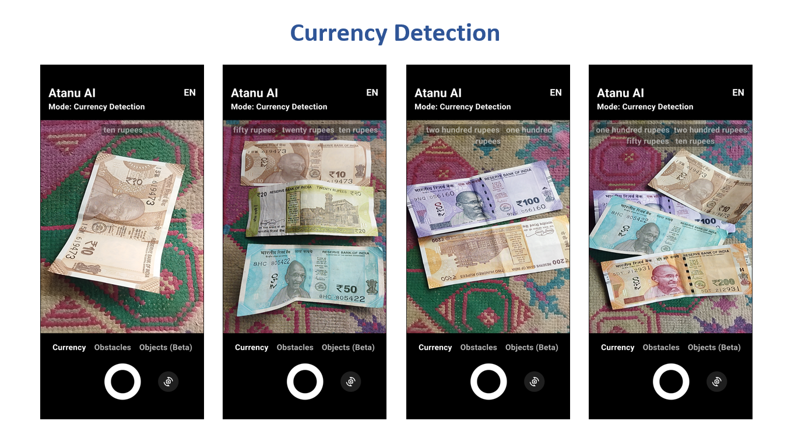
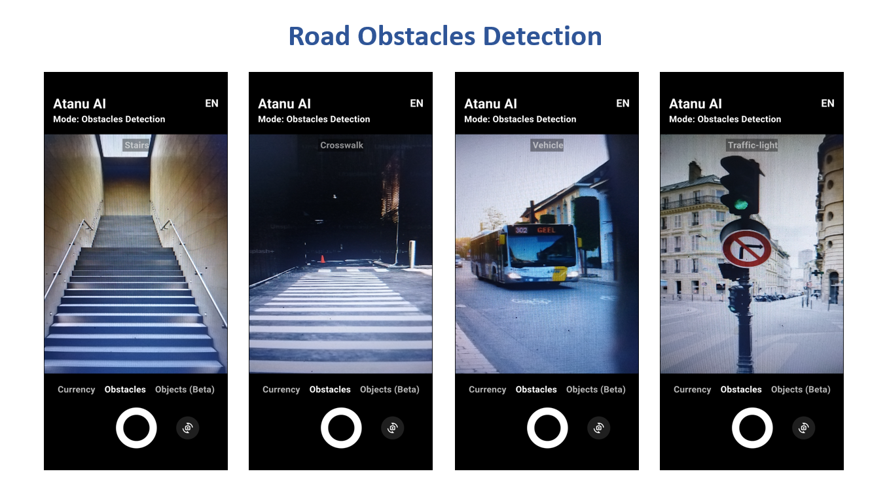

# Android Based Object Detection System for Visually Impaired

## Overview
The Android-based Object Detection System for Visually Impaired uses **YOLOv5**, a state-of-the-art object detection model, to detect and classify various objects in the user's environment. This application is built using **Flutter** for a responsive and user-friendly interface, enabling smooth deployment across Android devices.

## Screenshots

